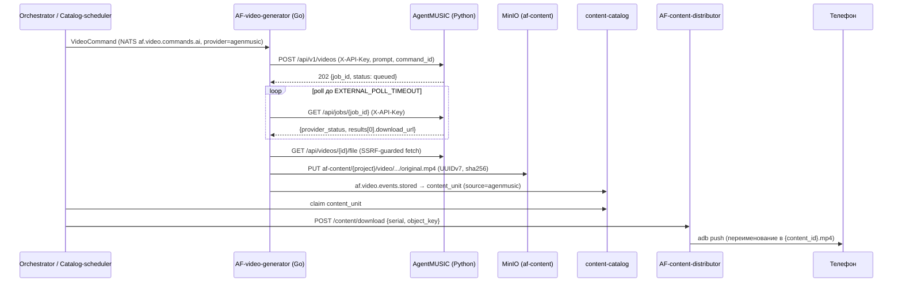

# Интеграция AgentMUSIC с платформой управления (AF)

Документ описывает, как AgentMUSIC подключается к системе управления фермой
телефонов как **внешний провайдер генерации видео** (пир к Kie.ai) через
микросервис **AF-video-generator**, и как готовые видео доезжают до телефонов
через **content-catalog → orchestrator → AF-content-distributor**.

- Кодовое имя провайдера на платформе: `agenmusic` (уже заведено: `validSources`
  каталога + квота `provider_quotas('agenmusic', 150, true)`).
- Go-адаптер: `AF-video-generator/internal/adapter/extprovider/agenmusic.go`
  (ветка `feat/agenmusic-provider-adapter`).

---

## 1. Архитектура



**Ключевое разделение ответственности.** AgentMUSIC **не** пишет в `af-content`,
**не** генерирует UUIDv7/`content_hash` и **не** общается с content-distributor —
всё это делает video-generator (проверенный код пути Kie.ai). Нога
content-distributor закрывается **транзитивно** через каталог и оркестратор;
прямого контракта AgentMUSIC↔distributor нет и не требуется.

---

## 2. HTTP-контракт AgentMUSIC (для адаптера)

### Аутентификация: два раздельных креденшла

| Маршрут | Креденшл |
|---|---|
| `POST /api/v1/videos`, `POST /api/generate`, `POST /api/tracks/*` (upload/spotify/process/minio-import), `POST /api/jobs/{id}/stop`, `POST /api/footage/prewarm`, `GET /api/tracks/minio`, `GET /api/jobs/{id}`, `GET /api/videos/{id}`, `GET /api/videos/{id}/file` | **машинный `X-API-Key`** (env `AGENTMUSIC_API_KEYS`, CSV) |
| `GET /api/jobs`, `GET /api/tracks`, `GET /api/choruses`, `GET /api/videos`, `GET /api/stats`, `GET /api/events` (SSE), `/dashboard`, `/static` | браузерные read-маршруты — защищаются **сетевой политикой / reverse-proxy (basic-auth)**; машинный ключ в браузер не попадает |
| `GET /health` | открыт |

**Fail-closed:** при `APP_ENV != local` и пустом `AGENTMUSIC_API_KEYS` все
защищённые маршруты возвращают **503** (+громкая ошибка в логе при старте).
В `local` без ключей — fail-open с WARNING (для dev/pytest).

### POST /api/v1/videos — submit (одна команда = одно видео)

```json
{
  "prompt": "Artist – Track",            // ровно ОДИН источник из четырёх:
  "minio_key": "Artist/Song.mp3",        //   prompt | minio_key | spotify_url | track_id
  "spotify_url": "https://open.spotify.com/track/...",
  "track_id": "abc123",
  "command_id": "джоб-ид коннектора",    // ОБЯЗАТЕЛЕН, идемпотентный ключ
  "scenario": "karaoke",                 // karaoke|slideshow|track_promo|cover_alive|pov_spotify
  "bg_type": "animated",                 // animated (дефолт, надёжно) | footage
  "aspect": "portrait",                  // portrait|landscape
  "project": "arena", "content_type": "video", "lang": "en",  // passthrough
  "allowed_platforms": ["tiktok"]
}
```

Ответ `202` (также допустимы 200/409 при повторе): `{"job_id": "...",
"status": "queued", "command_id": "...", "created": true|false}`.

Правила:
- **`count` нет.** Одна команда ⇒ один ассет ⇒ один content_unit. `count > 1` →
  422 (батч живёт только на внутреннем `POST /api/generate` c
  `videos_per_account`; платформа шлёт N команд для N видео — так же работает
  и catalog-scheduler, который раскладывает shortfall на отдельные VideoCommand).
- **Идемпотентность** (в пределах одного экземпляра): повтор `command_id` для
  живой/успешной задачи возвращает тот же `job_id` (`created:false`);
  для упавшей/осиротевшей — создаёт новую попытку.
- Ровно один источник трека, иначе 422.

### GET /api/jobs/{job_id} — poll

Поле `provider_status`: `queued | running | succeeded | failed | canceled`
(маппинг внутренних статусов: `running+phase=queued→queued`, `done→succeeded`,
`error→failed`, `stopped→canceled`). При `succeeded` — ровно один результат:

```json
{
  "provider_status": "succeeded",
  "results": [{ "video_id": "v1", "download_url": "/api/videos/v1/file",
                "minio_key": "agentmusic/<uid>/v1.mp4", "title": "...",
                "description": "...", "hashtags": ["..."] }],
  "error": ""
}
```

При `failed` поле `error` содержит actionable-сообщение (адаптер читает
`error`, затем `message`). `download_url` — относительный путь; адаптер сам
склеивает его с `base_url` и скачивает файл через SSRF-guarded клиент сервиса.

### Персистентность и рестарты

Задачи и карта `command_id→job_id` сохраняются в `output/_jobs/index.json`
(атомарная запись). При старте бота выполняется **reconcile**: нетерминальные
задачи либо ставятся в очередь заново (источники re-runnable; `spotify_url`/
`prompt` могут ре-резолвиться в другой трек — допустимо), либо помечаются
`failed` («orphaned by restart; re-issue command»). Задача никогда не остаётся
`running` без живого воркера. Краш между сохранением видео и завершением
задачи оставляет безвредный «осиротевший» рендер (в каталог он не попадает).

**Ограничение: ровно один экземпляр AgentMUSIC.** Стор, очередь и локи —
process-local; несколько реплик ломают идемпотентность и поллинг.
Масштабирование — вертикальное (CPU/GPU), не репликами.

---

## 3. Go-адаптер: что реально отправляется

Находки из реализации `agenmusic.go` (важно для операторов):

1. **Доменная модель платформы передаёт только `prompt`** (полей
   `minio_key`/`track_id` в `CommandParams` нет). Поэтому боевой путь:
   **прогреть библиотеку треков заранее** (см. runbook), а `prompt` формировать
   как `"Артист Название"` — резолвер AgentMUSIC сначала ищет по локальной
   библиотеке (подстрока в `artist title`) и только при промахе идёт в Spotify.
   Тёплый трек = ни Spotify, ни скачивания, сразу рендер.
2. **`command_id` = `job.ID` коннектора** (стабильный UUID на команду;
   коннектор дедупит команды по своему `UNIQUE(command_id)` в Postgres).
3. `scenario=karaoke`, `bg_type=animated` — фиксированные дефолты адаптера;
   `aspect` мапится из `9:16`/`16:9` или Width×Height.
4. Повторный submit принимает HTTP 200/201/202/409 — тело должно содержать `job_id`.
5. Poll: не-200 и сетевые ошибки — transient (поллинг продолжается до
   `EXTERNAL_POLL_TIMEOUT`); терминальны только `failed|canceled`.

### Подключение провайдера в video-generator

`agenmusic` уже есть в `DefaultConfig` и failover-порядке. Боевой запуск:

```bash
# env video-generator
EXTERNAL_MODE=real
AGENMUSIC_BASE_URL=http://agentmusic:8080     # адрес AgentMUSIC в сети платформы
AGENMUSIC_API_KEY=<тот же ключ, что в AGENTMUSIC_API_KEYS>
EXTERNAL_POLL_TIMEOUT=30m                     # см. бюджет латентности ниже
```

Готовый compose-оверлей: `deploy/docker-compose.agenmusic.yml` (рядом с
`docker-compose.kie.yml`). Подробности — `INTEGRATIONS.md` в репо коннектора.

---

## 4. Топология, compute и бюджет латентности

- AgentMUSIC — отдельный сервис (один процесс `python bot.py`: Telegram-бот +
  FastAPI + воркер). Он должен быть доступен адаптеру по HTTP и сам доставать
  треки из MinIO платформы (бакет `MINIO_TRACKS_BUCKET=music-tracks`).
- **Dockerfile — CPU-only** (нет CUDA). Транскрипция faster-whisper large-v3 на
  CPU — минуты на трек. GPU-деплой — главный рычаг пропускной способности.
- Два центра затрат:
  - **Резолюция трека** (на трек, кэшируется): скачивание + whisper + припев.
    Выполняется один раз; повторные команды на тот же трек её пропускают.
  - **Рендер** (на команду): ffmpeg, таймауты бандлов до 600с; воркер строго
    последовательный (очередь).
- Худший случай (холодный трек, CPU): 10–15+ минут. Рекомендации платформе:
  - `EXTERNAL_POLL_TIMEOUT ≥ 20–30 мин` для холодного пути; ≥ 5 мин для
    тёплого трека с `bg_type=animated`;
  - дефолты адаптера: `animated`, count=1, тёплые треки;
  - держать небольшую глубину очереди команд на провайдера `agenmusic`
    (квота 150/день уже стоит в `provider_quotas`).

---

## 5. Переменные окружения AgentMUSIC

| Переменная | Назначение |
|---|---|
| `AGENTMUSIC_API_KEYS` | CSV машинных ключей для `X-API-Key`. **Обязательна вне `APP_ENV=local`** (иначе 503). |
| `APP_ENV` | `local` (fail-open auth) / `production` и др. (fail-closed). |
| `TELEGRAM_BOT_TOKEN` | Телеграм-бот (обязателен для запуска процесса). |
| `PIXABAY_API_KEY`, `PEXELS_API_KEY` | Источники футажей для `bg_type=footage`; без них — автоматический фолбэк на `animated` с пометкой в задаче. |
| `DEEZER_ARL` | Полные треки через Deezer (streamrip). Проверка: `python scripts/check_deezer.py <spotify_url>`. |
| `SPOTIFY_CLIENT_ID/SECRET` | Только метаданные/ISRC и поиск по `prompt`. **С фев. 2026 Spotify отдаёт 403, если владелец приложения без Premium** — тогда используйте `minio_key`/загрузку MP3 (ошибка в задаче подскажет). |
| `MINIO_URL/ACCESS_KEY/SECRET_KEY` | Подключение к MinIO платформы. |
| `MINIO_TRACKS_BUCKET` | Бакет исходных треков (`music-tracks`). |
| `MINIO_BUCKET` | Куда AgentMUSIC дублирует готовые видео для себя (`atome-videos`, опционально — мастер в `af-content` кладёт адаптер). |
| `ANTHROPIC_API_KEY` | Опционально: заголовки/описания/хэштеги и умные запросы футажей. |
| `AGENTMUSIC_OWNER_ID` | Пользователь-владелец API-задач (single-tenant). |

---

## 6. Встраивание в UI системы управления (AF-frontend)

Реализовано в AF-frontend (ветка `feat/agenmusic-provider`), раздел
**«Управление → Контент» → секция «Генерация видео» → «Сервис генерации»**.

1. **Провайдер-чип «AgentMusic»** добавлен в `src/lib/aiVideoProviders.ts`
   (id строго `agenmusic` — так провайдер зовётся в реестре video-generator).
   При его выборе вместо свободного prompt показывается **пикер трека** из
   библиотеки AgentMUSIC.
2. **Запуск генерации идёт штатным путём фронта** — `POST
   /api/orch/phones/{serial}/video/ai {prompt, duration_sec, provider:"agenmusic",
   profile}` → phone-orchestrator (провайдер — свободная строка, прокидывается в
   gRPC `GenerateAI` без изменений оркестратора) → video-generator → адаптер
   `agenmusic` → AgentMUSIC. UI **не** ходит в AgentMUSIC для генерации.
3. **Пикер трека → prompt.** Фронт читает библиотеку через **новый upstream
   `/api/agentmusic`** (nginx `location` → `agentmusic:8080`; в dev — vite-proxy
   `VITE_AGENTMUSIC_PROXY_TARGET`), эндпоинт `GET /api/tracks`. Выбор трека
   подставляет prompt строго как **`Artist Title` через пробел** — резолвер
   AgentMUSIC сначала матчит библиотеку по подстроке `"{artist} {title}".lower()`;
   формат с « — » сорвал бы матч и ушёл в Spotify (риск 403). Есть фолбэк
   «ввести название вручную» (с предупреждением) на случай недоступной
   библиотеки.
4. **Доступ.** Read-роуты AgentMUSIC (`GET /api/tracks`, `GET /health`) отдаются
   через nginx под общим **Basic Auth** фронта; машинный `X-API-Key` в браузер
   не попадает (его использует только Go-адаптер server-to-server).
5. **Статус/доставка** — существующий поллер фронта опрашивает `GET
   /video/jobs/{id}` у оркестратора (статусы `PENDING|RUNNING|READY|FAILED`) и
   по `READY` сам доставляет видео из `af-videos` на телефон. Источник правды по
   контенту — content-catalog/коннектор, не AgentMUSIC.
6. **Сценарий пока фиксирован** (karaoke + animated в адаптере). Выбор
   сценария/фона из UI — следующая итерация: требует нового поля в цепочке
   orchestrator body → `GenerateAIRequest` proto → `agenmusic.go` → AgentMUSIC.
7. Дашборд AgentMUSIC (`/dashboard`) при желании можно встроить iframe/ссылкой
   **только для наблюдения**, под собственным креденшлом — но основной UI-поток
   идёт через раздел «Контент» выше.

### Деплой-предпосылки

- Сервис `agentmusic` (образ AgentMUSIC, `:8080`) — в той же docker-сети, что
  фронт и оркестратор; env `AGENMUSIC_BASE_URL=http://agentmusic:8080`,
  `AGENMUSIC_API_KEY` = ключ из `AGENTMUSIC_API_KEYS`. video-generator — с
  оверлеем `deploy/docker-compose.agenmusic.yml` (`EXTERNAL_MODE=real`).
- **Не задавать `CONTENT_DEFAULT_PROJECT`** у video-generator для UI-потока:
  оркестратор не шлёт `project/content_type`, и при заданном дефолте задача
  уйдёт в content-pipeline (`af-content`, пустой `output_key`), тогда как
  UI-доставка фронта заточена под legacy-ключ `af-videos/videos/{serial}/{id}.mp4`.
- **Прогреть библиотеку треков** до показа пикера: `POST
  /api/tracks/minio/import-batch` (иначе список пуст — фронт покажет подсказку
  про импорт).

---

## 7. Примеры (curl)

```bash
BASE=http://agentmusic:8080; KEY=<machine-key>

# здоровье (открыт)
curl -s $BASE/health

# прогрев футажей (опционально, для bg_type=footage)
curl -s -X POST "$BASE/api/footage/prewarm?orientation=portrait" -H "X-API-Key: $KEY"

# импорт треков из MinIO (прогрев библиотеки: транскрипция + припевы)
curl -s $BASE/api/tracks/minio -H "X-API-Key: $KEY"
curl -s -X POST $BASE/api/tracks/minio/import-batch -H "X-API-Key: $KEY" \
  -H 'Content-Type: application/json' -d '{"keys":["Artist/Song.mp3","Artist/Song2.mp3"]}'

# submit: одна команда -> одно видео
curl -s -X POST $BASE/api/v1/videos -H "X-API-Key: $KEY" -H 'Content-Type: application/json' \
  -d '{"minio_key":"Artist/Song.mp3","scenario":"karaoke","bg_type":"animated",
       "aspect":"portrait","command_id":"cmd-0001"}'

# poll
curl -s $BASE/api/jobs/<job_id> -H "X-API-Key: $KEY"

# скачать готовый файл (это делает адаптер)
curl -s -o out.mp4 $BASE/api/videos/<video_id>/file -H "X-API-Key: $KEY"
```

---

## 8. Runbook

1. **Первый запуск**: заполнить `.env` (см. §5), `python bot.py`. Проверка:
   `python scripts/check_readiness.py` (env, Pixabay/Pexels, MinIO, ffmpeg;
   `--whisper` — дополнительно грузит модель large-v3 и показывает device).
2. **Миграция существующих вызывателей (ломающее изменение!):** после
   включения `APP_ENV != local` все интеграции обязаны слать `X-API-Key`,
   иначе получат 503/401. Прописать ключ в адаптере (env `AGENMUSIC_API_KEY`)
   и других клиентах ДО боевого деплоя.
3. **Прогрев библиотеки треков** (рекомендуемый боевой путь): залить MP3 в
   бакет `music-tracks` → `POST /api/tracks/minio/import-batch` (или batch по
   одному). После этого команды платформы с `prompt="Артист Название"`
   резолвятся локально без Spotify.
4. **Футажи**: задать `PIXABAY_API_KEY`/`PEXELS_API_KEY`; при желании прогреть
   `POST /api/footage/prewarm`. Кэш чистится при рестарте бота и наполняется
   заново при первом рендере с footage. Без ключей рендер не падает —
   используется анимированный фон (пометка в задаче).
5. **Треки не качаются по Spotify-ссылке**: если в ошибке задачи упомянут 403 —
   это политика Spotify (Premium-владелец приложения). Обход: `minio_key` /
   загрузка MP3. Deezer-ногу проверить `scripts/check_deezer.py`.
6. **Медленный рендер / таймауты поллинга**: проверить device у whisper
   (`check_readiness.py --whisper`), поднять `EXTERNAL_POLL_TIMEOUT`,
   использовать тёплые треки и `animated`; долгосрочно — GPU.
7. **После рестарта** задачи восстанавливаются автоматически (reconcile в
   логе: «перезапущены после рестарта» / «orphaned by restart»).

---

## Приложение A. Будущий режим «продюсер контент-пула» (не реализовано)

Если платформе понадобится **пре-генерированный пул** (AgentMUSIC сам наполняет
каталог без команд), контракт продюсера таков (сегодня его выполняет
video-generator; переносить в Python только при реальной потребности):

1. Мастер в MinIO **`af-content`**, ключ
   `{project}/{type}/{yyyy}/{mm}/{dd}/{content_id}/original.mp4` (+`thumb.jpg`),
   `content_id` — **UUIDv7** (каталог отвергает другие), метаданные объекта
   `content-id/project/type`, `content_hash = "sha256:"+hex` (глобальный ключ
   дедупа).
2. Регистрация юнита: NATS `af.video.events.stored` (stream `AF_VIDEO_EVT`,
   заголовок `Nats-Msg-Id=<content_id>:stored`, payload `StoredEvent`) или REST
   `POST content-catalog:8081/content/register` с теми же полями
   (`source:"agenmusic"`, `location{bucket, original_key, thumb_key}`,
   `allowed_platforms`, `width/height/duration_seconds/lang`).
3. Дальше юнит живёт лайфциклом каталога: `available → reserved → downloaded →
   published` (клеймит оркестратор, доставляет distributor).

Плюс режима — амортизация (один трек → батч видео в пул) и работа без команд;
минус — дублирование UUIDv7/hash/StoredEvent-логики в Python с риском дрейфа
контракта. Решение об активации — отдельной задачей.
